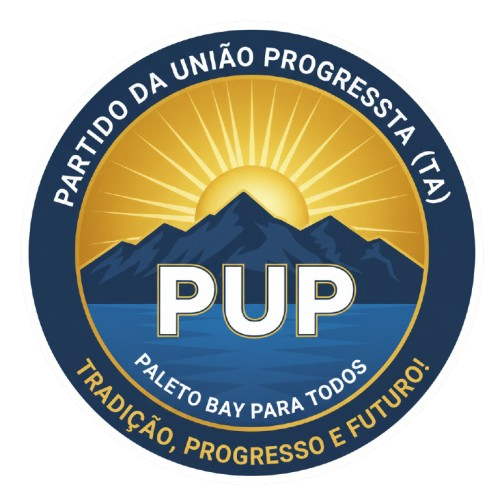

# Partido da União Progressista (PUP)

<figure><figcaption></figcaption></figure>

Campanha Eleitoral – Paleto Bay, Dana Verso

<table data-view="cards"><thead><tr><th></th><th data-hidden data-card-cover data-type="image">Cover image</th></tr></thead><tbody><tr><td>
<i class="fa-leaf">:leaf:</i> <strong>Contexto da Cidade</strong>

Reconhecida por sua beleza natural, sua comunidade trabalhadora e um potencial enorme para o turismo, tecnologia e agricultura sustentável.
</td><td><a href=".gitbook/assets/Captura de tela 2025-10-05 204759.png">Captura de tela 2025-10-05 204759.png</a></td></tr><tr><td>Desde sua fundação, o partido tem como missão <strong>fazer a política voltar a ser uma ferramenta de transformação social</strong>, e não de interesses pessoais. Foi com esse propósito que <strong>Yamal Bittencourt</strong>, um gestor jovem e visionário, junto a <strong>Billy James</strong>, um líder comunitário de voz forte e coração popular, uniram forças para escrever uma nova história em Paleto Bay.</td><td data-object-fit="contain"><a href=".gitbook/assets/Gemini_Generated_Image_tbuw2ntbuw2ntbuw-removebg-preview.png">Gemini_Generated_Image_tbuw2ntbuw2ntbuw-removebg-preview.png</a></td></tr><tr><td><h4>Ideologia do Partido</h4>
O <strong>Partido da União Progressista (PUP)</strong> acredita que o futuro nasce quando há <strong>união entre inovação e empatia</strong>. A política deve servir para aproximar, não dividir. O progresso só é verdadeiro quando alcança todos os cidadãos — da zona rural ao centro urbano, dos empresários aos trabalhadores.
<blockquote>
“Progredir sem deixar ninguém para trás.”
</blockquote>
Essa é a essência do <strong>Progressismo Responsável</strong>, base do governo Japa e Billy.
</td><td data-object-fit="contain"><a href=".gitbook/assets/Captura de tela 2025-10-05 205533.png">Captura de tela 2025-10-05 205533.png</a></td></tr></tbody></table>

\\



<figure><figcaption></figcaption></figure>

<figure><figcaption></figcaption></figure>

<figure><figcaption></figcaption></figure>

<figure><figcaption></figcaption></figure>



#### Nossa Fundação

O atual governo tem suas raízes no **Partido da União Progressista (PUP)** — uma organização política fundada sobre três pilares fundamentais: **União, Progresso e Transparência**.\
Criado em meio a uma era de descrença política, o PUP surgiu para reconstruir a ponte entre o poder público e a população, valorizando o diálogo, a empatia e a eficiência administrativa.

\
**Nossa Ideologia**

O **Partido da União Progressista** acredita em uma governança baseada em **equilíbrio entre inovação e tradição**.\
Não se trata de romper com o passado, mas de aprender com ele — valorizando a cultura e o trabalho das gerações que construíram a cidade, enquanto abrimos espaço para a modernidade, a tecnologia e as novas formas de pensar.

Nossa ideologia é o **Progressismo Responsável**:

> “Progredir, sem deixar ninguém para trás.”

Isso significa buscar crescimento econômico e tecnológico **sem perder a essência humana e comunitária** que faz de Paleto Bay um lugar único.\
Cada decisão é guiada por princípios de **justiça social, sustentabilidade e ética pública**, sempre priorizando a transparência e a participação popular.

#### Nossa Visão de Futuro

O Governo de Paleto Bay acredita que o futuro começa **quando o povo tem voz**.\
A visão que guia cada projeto é transformar Paleto Bay em **um modelo de cidade inteligente, sustentável e humana**, onde qualidade de vida, inovação e natureza convivem em harmonia.

Queremos uma cidade que:

* Produza energia limpa e preserve suas praias.
* Gere empregos sem degradar o meio ambiente.
* Tenha escolas de qualidade e oportunidades reais para os jovens.
* Seja segura, acessível e conectada.

Paleto Bay será **referência em gestão pública dentro de Dana Verso** — uma cidade que inspira, acolhe e lidera com exemplo.

**Visão e Missão**

**Visão:**\
Fazer de Paleto Bay uma cidade inteligente, segura e sustentável — exemplo de equilíbrio entre desenvolvimento e qualidade de vida.

**Missão:**\
Garantir que cada morador tenha voz, oportunidades e orgulho de viver em Paleto Bay.\
Nosso governo trabalha para reduzir desigualdades, atrair investimentos e gerar progresso sem comprometer o meio ambiente.

#### Ideologia do Partido

O **Partido da União Progressista (PUP)** acredita que o futuro nasce quando há **união entre inovação e empatia**.\
A política deve servir para aproximar, não dividir.\
O progresso só é verdadeiro quando alcança todos os cidadãos — da zona rural ao centro urbano, dos empresários aos trabalhadores.

> “Progredir sem deixar ninguém para trás.”

Essa é a essência do **Progressismo Responsável**, base do governo Japa e Billy.



<h2 align="center"></h2>

***

<h2 align="center">Qual é a nossa "chapa"?</h2>

Fundamentado nos princípios do Partido da União Progressista (PUP), o governo de <strong>Yamal “Japa” Bittencourt e Billy James</strong> busca devolver à população o direito de sonhar com um futuro mais digno — com oportunidades, segurança e orgulho de viver em Paleto Bay.

<figure><figcaption></figcaption></figure>

<table><thead><tr><th>Cargo</th><th>Perfil</th><th>Origem</th><th>Experiência</th><th data-hidden data-type="image">Cover image</th></tr></thead><tbody><tr><td><strong>Prefeito</strong></td><td>Gestor moderno, técnico e próximo do povo, com uma visão de longo prazo e sensibilidade social.</td><td>Descendente de japoneses, nascido e criado em Paleto Bay.</td><td>Engenheiro Civil com MBA em Gestão Pública. e Artes.</td><td></td></tr><tr><td><strong>Vice-Prefeito</strong></td><td>Carismático, acessível, símbolo da voz do povo nas decisões públicas.</td><td>Líder comunitário, nascido no interior de Dana Verso, mudou-se jovem para Paleto Bay.</td><td>Presidente da Associação de Moradores e articulador de projetos sociais locais.</td><td></td></tr><tr><td></td><td></td><td></td><td></td><td></td></tr></tbody></table>

***


#### Eixos do Programa de Governo

**1. Desenvolvimento Econômico e Inovação**

* Criação do **Distrito Empresarial de Paleto Bay** para atrair startups e empresas tecnológicas.
* Implantação da **Incubadora de Negócios Locais** com crédito facilitado e mentorias.
* Fomento ao turismo sustentável e ao agronegócio de pequeno porte.

***

**2. Segurança e Cidadania**

* **Programa Bairro Seguro:** policiamento comunitário e câmeras inteligentes.
* **Base Integrada de Proteção Cidadã:** integração entre Guarda, Polícia e Defesa Civil.
* Investimento em esporte e cultura como prevenção à criminalidade.

***

**3. Infraestrutura e Mobilidade**

* Pavimentação ecológica nas áreas periféricas.
* Revitalização da orla e construção de novos espaços de lazer.

***

**4. Educação e Cultura**

* Criação das **Escolas Técnicas Municipais** e **Programa Jovem Digital com Web-Cursos Mentorados**.
* Internet gratuita em praças, escolas e igrejas.
* Eventos mensais de cultura e gastronomia para movimentar o turismo interno.

***

**5. Saúde e Bem-Estar**

* Construção de um **Hospital 24h** e expansão das Unidades de Saúde da População (medicamentos).
* Atendimento psicológico gratuito e programas de prevenção à dependência química.
* Modernização do Hospital Municipal e mutirões de saúde em bairros afastados.

***

**6. Sustentabilidade e Meio Ambiente**

* **Plano Paleto Verde 2030**: energia solar, reciclagem e reflorestamento urbano.
* Incentivo à agricultura orgânica e turismo ecológico.
* Programa **“Praia Limpa, Cidade Viva”** para proteger o litoral.

***

#### 🗣 Comunicação e Engajamento Popular

* **Plataformas digitais** para acompanhar obras, serviços e prestação de contas.
* **Audiências públicas mensais** em diferentes bairros.
* **Aplicativo Cidadão PUP** (projeto futuro): canal direto para sugestões, denúncias e pedidos de serviço.


***

## Cronograma da Campanha

<table><thead><tr><th width="112.44439697265625">Fase</th><th width="237.22222900390625"></th><th width="617.77783203125"></th></tr></thead><tbody><tr><td>1</td><td>Lançamento</td><td>Apresentação pública do plano e abertura da campanha em vídeo.</td></tr><tr><td>2</td><td>Mobilização Popular</td><td>Mutirões de bairro, informativos semanais e rodas de conversa comunitárias.</td></tr><tr><td>3</td><td>Consolidação</td><td>Divulgação de resultados de projetos piloto e parcerias.</td></tr><tr><td>4</td><td>Reta Final</td><td>Debates públicos, grandes comícios e campanha nas redes sociais.</td></tr></tbody></table>

***

<table><thead><tr><th width="270.88885498046875">Valor</th><th width="616.666748046875">Significado</th></tr></thead><tbody><tr><td>União</td><td>Trabalhar juntos por um bem maior, sem divisões políticas.</td></tr><tr><td>Justiça Social</td><td>Oportunidades iguais para todos os cidadãos.</td></tr><tr><td>Transparência</td><td>A população como fiscal e parceira da gestão.</td></tr><tr><td>Sustentabilidade</td><td>Progresso sem destruir o que nos sustenta.</td></tr><tr><td>Participação Popular</td><td>Cada voz tem poder na construção da cidade.</td></tr></tbody></table>

***

> #### 💬 Mensagem do Prefeito
>
> > “Paleto Bay é uma joia que estava adormecida.\
> > O que queremos é despertar o potencial dessa cidade e de sua gente.\
> > O futuro de Dana Verso começa aqui, e ele será construído com trabalho, inovação e união.”
> >
> > — **Yamal “Japa” Bittencourt, Prefeito de Paleto Bay**
>
> ***
>
> #### 💬 Mensagem do Vice-Prefeito
>
> > “Eu conheço as ruas de Paleto Bay, porque vivi nelas.\
> > Sei o que falta, sei o que dói e sei o que pode mudar.\
> > Estou aqui para garantir que ninguém fique de fora.”
> >
> > — **Billy James, Vice-Prefeito**
